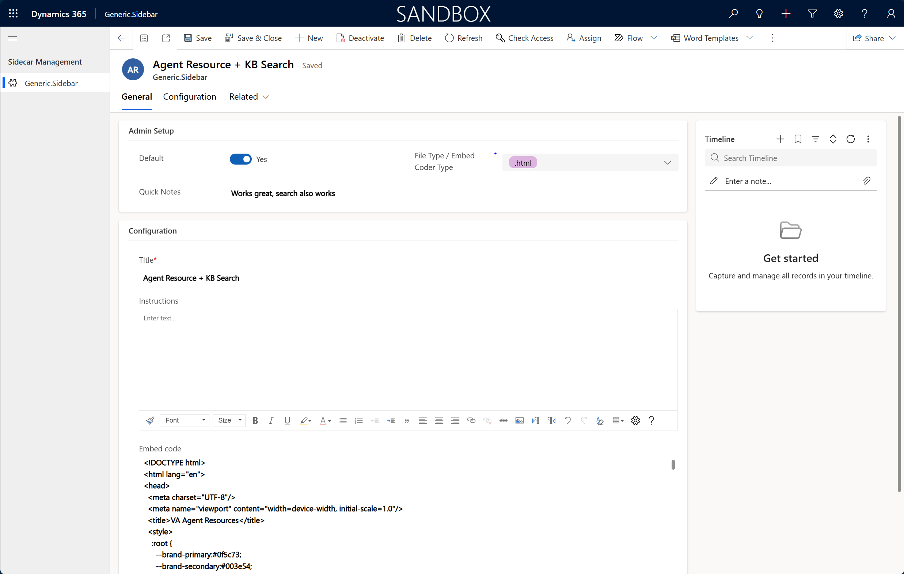
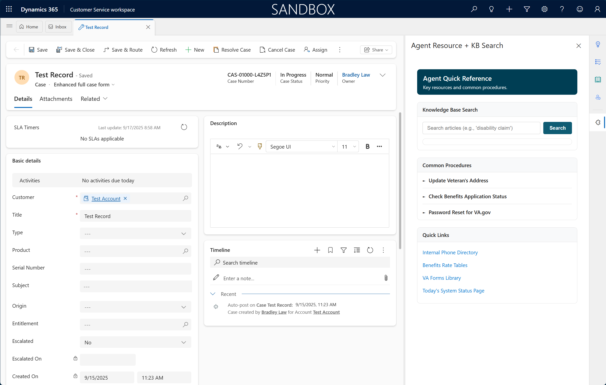
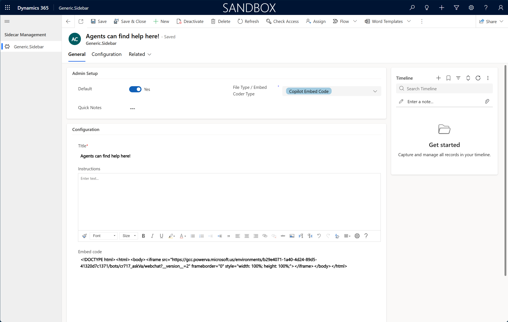
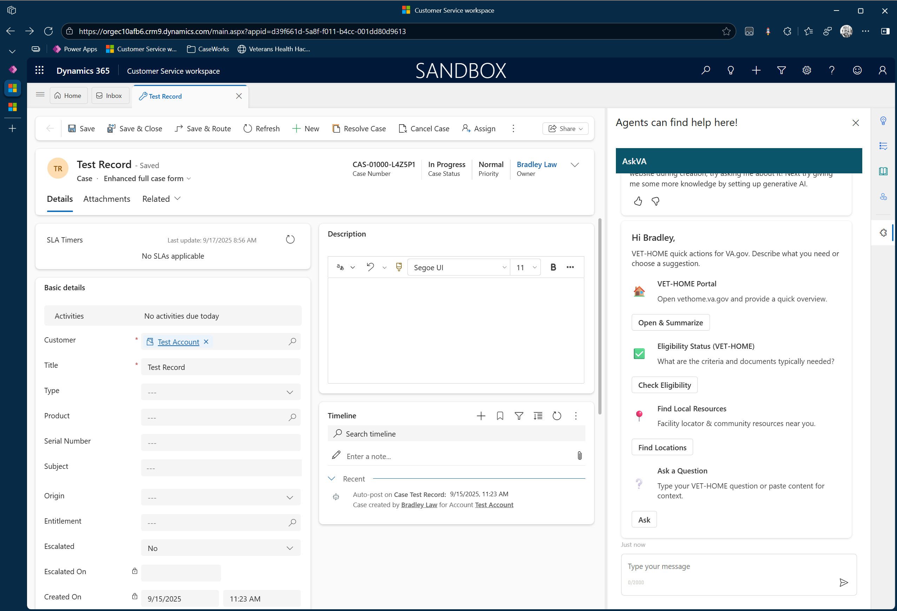

🚀 Generic Sidebar for Dynamics 365 — Release v1.0.5
The Generic Sidebar kit provides a flexible, table-driven side pane for Dynamics 365 Customer Service and other model-driven apps.
Instead of writing custom HTML/JS each time, you configure a single Dataverse table row to control instructions, embeds, icons, and theming.

✨ What’s New in v1.0.5
✅ Admin Acknowledgement Banner
Added a demo disclaimer banner visible only to admins.

Includes a “Acknowledge” button that flips sidebar_acknowledged = Yes in the default row.
Ensures clear consent before use in production.

✅ PowerApps Canvas App support
The sidebar_embedcode field now accepts Canvas App embed code alongside Copilot, URLs, HTML snippets, and web resources.

✅ Improved Copilot Embeds

Full-height rendering ensured.
Optional theming applied via sidebar_primarycolor, sidebar_textcolor, sidebar_linkcolor.

✅ Flow Template (Docs)
Release notes & docs now include a recommended Power Automate Flow to enforce a single default row at any time.

🛠 Features
Table-driven config (sidebar_genericsidebar) — no redeployments required.
Rich instructions band with bullet/heading normalization.
Embed options:

Copilot Studio Bot
External Websites
Internal Web Resources
Raw HTML Snippets
PowerApps Canvas Apps

Optional icon field (sidebar_sidebaricon) in header.
Full iframe customization (allow, style, width, height).
Safe defaults (auto-applied allow attributes, strict referrer policy).

⚡ Usage Instructions
Import the Solution
Import the managed/unmanaged solution into your Dynamics 365 environment.

Create a Config Row
Open the Generic Sidebar Configuration table (sidebar_genericsidebar) and create one record with sidebar_default = Yes.

Set Key Fields
Fill in:

sidebar_title — header title (shown in the pane chrome).
sidebar_instructions — rich text instructions (bullets/headings supported).
sidebar_embedcode — choose:

https://... (External URL)
webresource:YourResource.html
<iframe ...></iframe> (Copilot or Canvas App)
Raw HTML

Example of HTML Configuratuion

Example Displayed to End User

Example of Coplot Studio Configuratuion

Example Displayed to End User

Add JS to Form
Add the generic_sidebar.js web resource to your form and set OnLoad handler → Generic_OpenSidebar.

Publish & Refresh
Publish all customizations, then hard refresh (Ctrl/Cmd+Shift+R).

📋 Known Limitations
External sites may block embedding (X-Frame-Options / CSP).
sidebar_acknowledged is optional; banner skipped if missing.
No telemetry; use GitHub Release downloads for adoption tracking.

⚠️ Disclaimer
This kit is provided as-is. It is intended primarily for demo / proof-of-concept purposes.
Before production use, admins must acknowledge the disclaimer via the welcome banner (sets sidebar_acknowledged = Yes).

📌 Pro tip: Use annotated screenshots with arrows/callouts so people immediately see which fields to configure.
