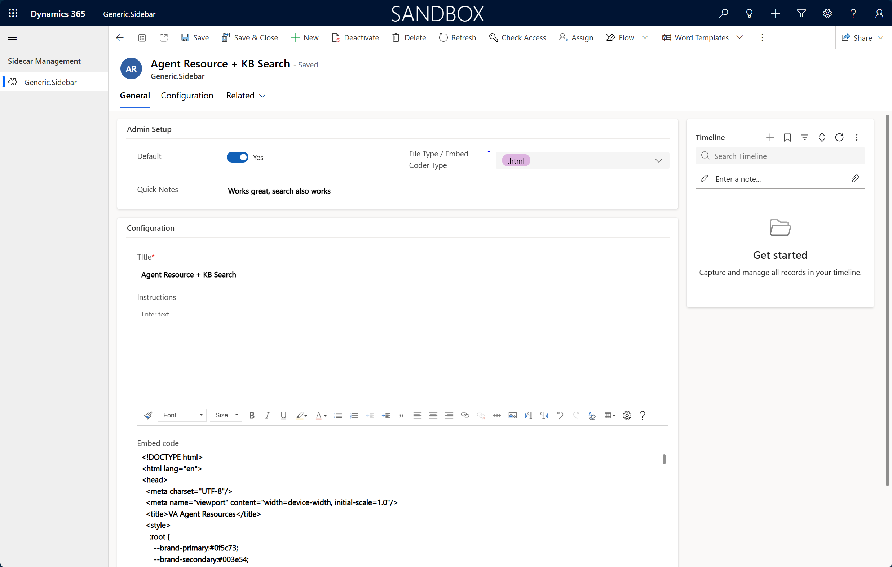
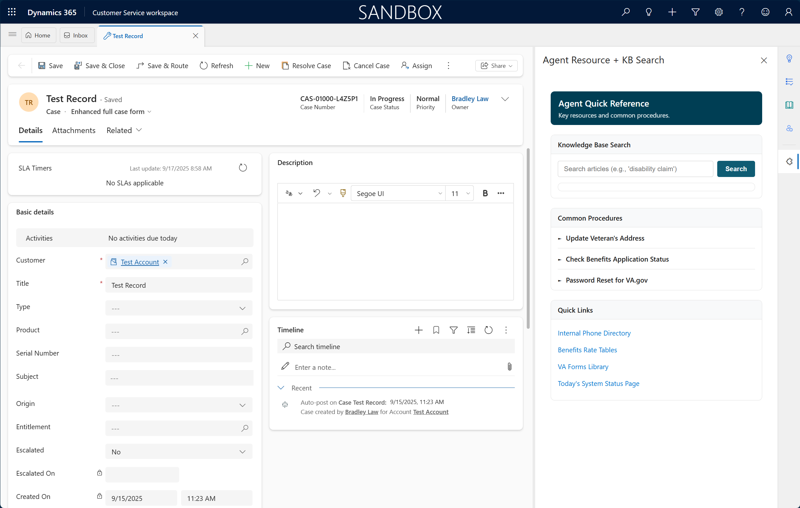
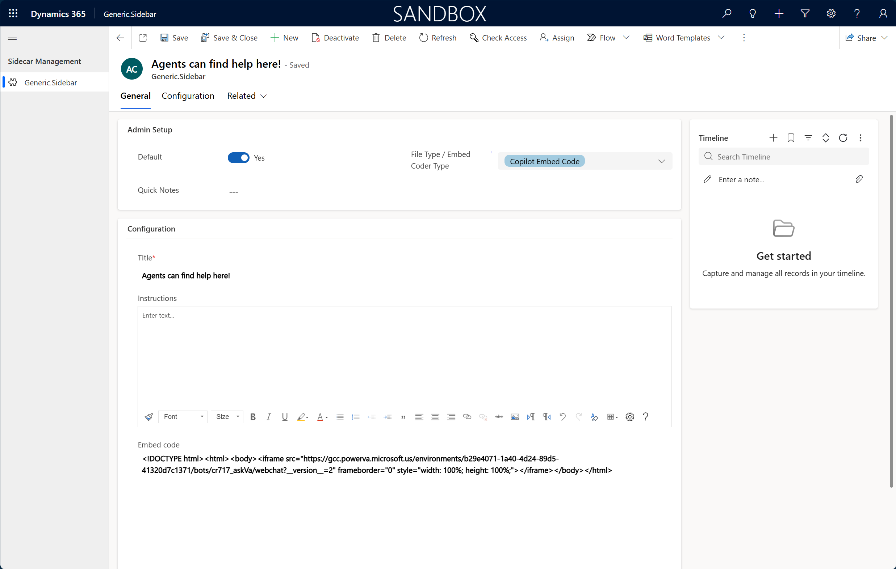
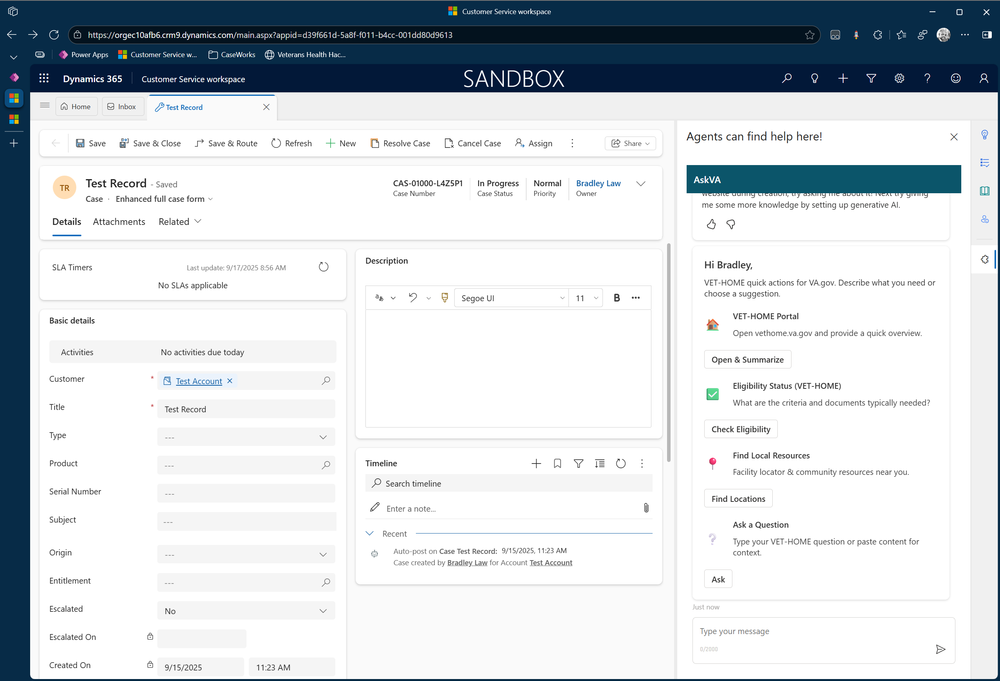
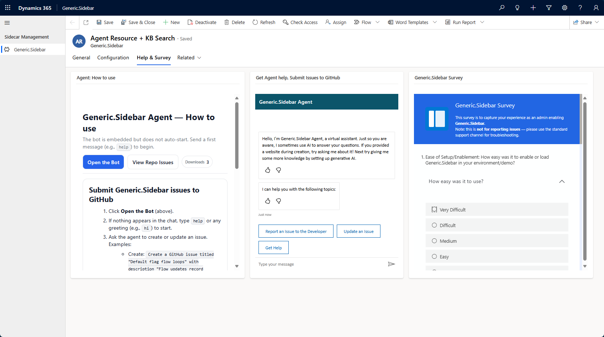

🚀 Generic Sidebar for Dynamics 365 — Release v1.0.5
The Generic Sidebar kit provides a flexible, table-driven side pane for Dynamics 365 Customer Service and other model-driven apps.
Instead of writing custom HTML/JS each time, you configure a single Dataverse table row to control instructions, embeds, icons, and theming.

✨ What’s New in v1.0.5

✅ Admin Acknowledgement Banner
* Added a demo disclaimer banner visible only to admins.
* Includes a “Acknowledge” button that flips sidebar_acknowledged = Yes in the default row.
* Ensures clear consent before use in production.

✅ PowerApps Canvas App support
* The sidebar_embedcode field now accepts Canvas App embed code alongside Copilot, URLs, HTML snippets, and web resources.

✅ Improved Copilot Embeds
* Full-height rendering ensured.
* Optional theming applied via sidebar_primarycolor, sidebar_textcolor, sidebar_linkcolor.

✅ Flow Template (Docs)
* Release notes & docs now include a recommended Power Automate Flow to enforce a single default row at any time.

🛠 Features
* Table-driven config (sidebar_genericsidebar) — no redeployments required.
* Rich instructions band with bullet/heading normalization.
* Embed options:
  * Copilot Studio Bot
  * External Websites
  * Raw HTML Snippets
  * PowerApps Canvas Apps

🪖 Optional
* Optional icon field (sidebar_sidebaricon) in header.
* Full iframe customization (allow, style, width, height).
* Safe defaults (auto-applied allow attributes, strict referrer policy).

---

## 📱 Android Cell Phone Simulator (Samsung S25 Ultra)

A self-contained HTML phone simulator used as a sidecar embed for contact center demos.

**File:** `Generic.AndroidCellPhone/AndroidCellPhone.html` — **Version 2.3.0**

### Features
* Samsung S25 Ultra chassis with realistic home screen, dock, status bar
* Outgoing + incoming call flows via `localStorage.genericSimCall`
* Dual mode: **D365 Mode** (Xrm.WebApi reads from Dataverse) / **Standalone Mode** (embedded fallback JSON)
* Demo Control Panel (Ctrl+Shift+D) — profile selector, transcript toggle, browser URL config
* Embedded iframe browser (Chrome icon) with DuckDuckGo search, blocked-site detection, "Open in New Tab" fallback
* Web Audio API synthesized ringtone (440+480 Hz dual-tone, 2s on / 4s off cadence)
* Fallback wallpaper, default Insurance Inquiry transcript

### Dataverse Schema
* **Table 1:** `gensoft_genericsoftphone` — softphone configuration (ringtone, transcript, pop mode, wallpaper)
* **Table 2:** `gensoft_demo_profile` — pre-built demo profiles (queue/caller/scenario presets)
* **Solution:** GenericSoftphone v1.0.0.11 (Unmanaged)
* **Deployment script:** `specs/main/scripts/create-dataverse-schema.ps1`

---

⚡ Usage Instructions
1. Import the Solution
2. Import the managed/unmanaged solution into your Dynamics 365 environment.
3. Create a Config Row
   Open the Generic Sidebar Configuration table (sidebar_genericsidebar) and create one record with sidebar_default = Yes.
4. Set Key Fields
   Fill in:
   * sidebar_title — header title (shown in the pane chrome).
   * sidebar_instructions — rich text instructions (bullets/headings supported).
   * sidebar_embedcode — choose:

   https://... (External URL)
   <iframe ...></iframe> (Copilot or Canvas App)
   Raw HTML

Example of HTML Configuration

Example Displayed to End User

Example of Copilot Studio Configuration

Example Displayed to End User

Help, Issue Reporting and Survey\

How to Add JS to a new Form
1. Add the generic_sidebar.js web resource to your form and set OnLoad handler → Generic_OpenSidebar.
2. Publish & Refresh
3. Publish all customizations, then hard refresh (Ctrl/Cmd+Shift+R).

📋 Known Limitations
* External sites may block embedding (X-Frame-Options / CSP).
* sidebar_acknowledged is optional; banner skipped if missing.

⚠️ Disclaimer
This kit is provided as-is. It is intended primarily for demo / proof-of-concept purposes.
Before production use, admins must acknowledge the disclaimer via the welcome banner (sets sidebar_acknowledged = Yes).
