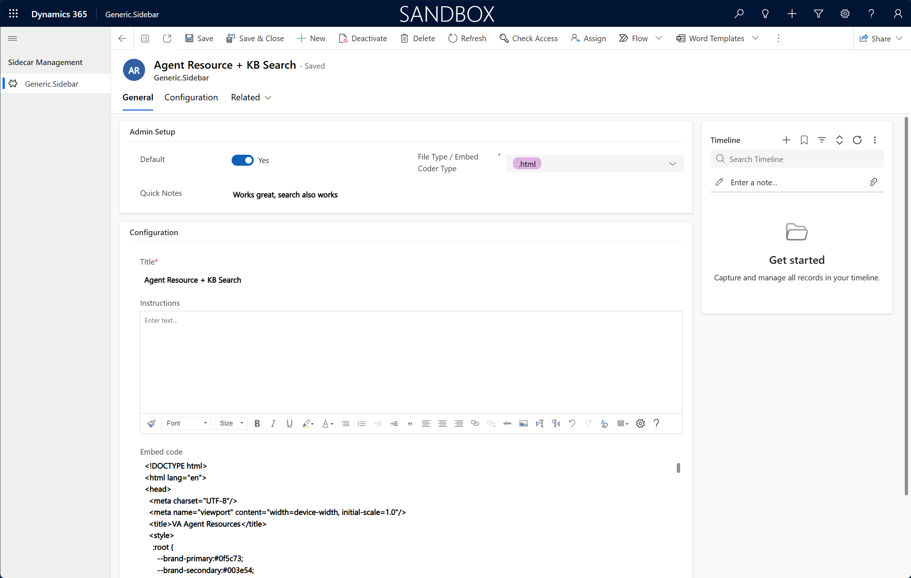
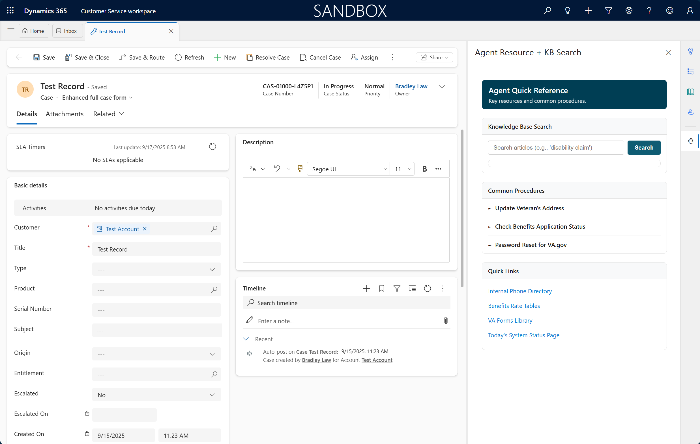
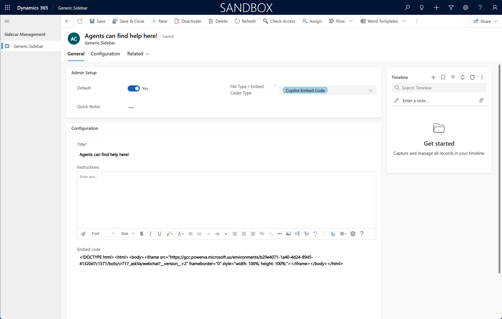
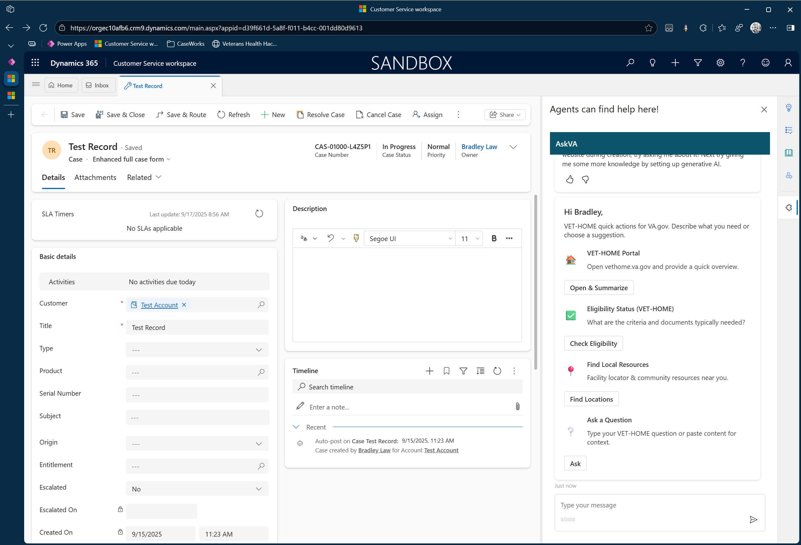
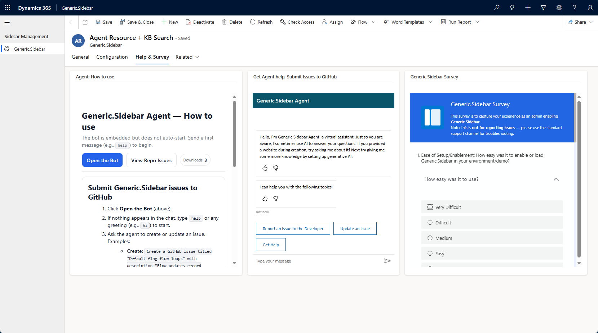

🚀 Generic Sidebar for Dynamics 365 — Release v2.0.0
The Generic Sidebar kit provides a flexible, table-driven side pane for Dynamics 365 Customer Service and other model-driven apps with **enterprise-grade Single Sign-On (SSO)** support.

Instead of writing custom HTML/JS each time, you configure a single Dataverse table row to control instructions, embeds, icons, theming, and SSO authentication—with **zero hardcoding** and **full backwards compatibility**.

✨ What's New in v2.0.0 — **Enterprise SSO Integration**

🔐 **Single Sign-On (SSO) for Copilot Studio**
* Users authenticate once to Dynamics 365, then access Copilot agents seamlessly (no sign-in prompts).
* MSAL 2.38.3 OAuth PKCE flow with silent token acquisition.
* Session-scoped token caching — tokens cleared on browser close for security.
* Graceful fallback — if SSO fails, standard canvas embeds continue working.

🛠 **Complete Admin Toolkit**
* **ADMIN_SETUP_GUIDE.md** — Step-by-step configuration (10 sections, Entra app registration to end-to-end testing).
* **SECURITY_GUIDE.md** — Token lifecycle, credential storage, HIPAA compliance, GCC/GCCH region support.
* **TROUBLESHOOTING.md** — 26 error categories with root causes and remediation steps.
* **Add-SidebarSSOFields.ps1** — PowerShell automation to extend Dataverse table with 8 SSO fields.
* **Configuration Validator Tool** — Admin preflight checks for SSO setup.

📊 **Product-Grade Architecture**
* Runtime configuration is stored in Dataverse (Client IDs, Token Endpoints) — not in code. Do not store browser client secrets in configuration records.
* Single configuration per Dataverse row — reusable across environments (dev/test/prod).
* Multi-region support: Commercial, GCC, GCCH endpoints.
* OAuth card middleware suppression — prevents infinite login loops.

🔄 **Full Backwards Compatibility**
* Non-SSO configs work exactly as before (no changes required).
* v1.0.5 → v2.0.0 upgrade is seamless (optional SSO adoption).

---

### Previous Release Highlights (v1.0.5)

✅ Admin Acknowledgement Banner
* Added a demo disclaimer banner visible only to admins.
* Includes a “Acknowledge” button that flips sidebar_acknowledged = Yes in the default row.
* Ensures clear consent before use in production.

✅ PowerApps Canvas App support
* The sidebar_embedcode field now accepts Canvas App embed code alongside Copilot, URLs, HTML snippets, and web resources.

✅ Improved Copilot Embeds
* Full-height rendering ensured.
* Optional theming applied via sidebar_primarycolor, sidebar_textcolor, sidebar_linkcolor.

✅ Flow Template (Docs)
* Release notes & docs now include a recommended Power Automate Flow to enforce a single default row at any time.

🛠 Features
* Table-driven config (sidebar_genericsidebar) — no redeployments required.
* Rich instructions band with bullet/heading normalization.
* Embed options:
  * Copilot Studio Bot
  * External Websites
  * Raw HTML Snippets
  * PowerApps Canvas Apps

🪖 Optional
* Optional icon field (sidebar_sidebaricon) in header.
* Full iframe customization (allow, style, width, height).
* Safe defaults (auto-applied allow attributes, strict referrer policy).

---

## � Getting Started with SSO (v2.0.0)

If you're deploying Generic Sidebar with Copilot Studio agents:

1. **Read:** [ADMIN_SETUP_GUIDE.md](ADMIN_SETUP_GUIDE.md) — Complete step-by-step configuration
2. **Review:** [SECURITY_GUIDE.md](SECURITY_GUIDE.md) — Token lifecycle and compliance requirements
3. **Run:** `Add-SidebarSSOFields.ps1` — Automatically extend Dataverse table with SSO fields
4. **Validate:** Use `sidebar_sso_config_validator.html` — Preflight checks before deployment
5. **Troubleshoot:** [TROUBLESHOOTING.md](TROUBLESHOOTING.md) — 26 error scenarios with solutions

**First-time setup takes ~30 minutes.** Re-environment deployment is a single Dataverse record copy.

## SSO Validation Status (2026-07-23)

The Dataverse-driven multi-agent picker and SSO handoff were validated in this branch.

Validated behaviors:
- Agent picker renders from Dataverse child-table model with fallback list when Dataverse rows are unavailable.
- Picker selection transitions UI state from action panel to active chat frame mode.
- Selected agent metadata is encoded and passed to the SSO canvas via data query payload.
- SSO canvas parses tokenEndpoint and usertoken parameters and performs Direct Line token exchange logic.

Validation caveat:
- Local file:// preview cannot complete real Entra interactive token acquisition in all environments. Final sign-in validation must be executed in hosted Dynamics context.
- The local configuration validator checks format and field consistency only; it does not perform live Dataverse, Entra, or Copilot Studio validation.
- The functional pre-admin-review source baseline is tagged `admin-review-baseline-2026-08-05`.

Deployment validation checklist:
1. Open the side panel from Dynamics (not from file://).
2. Select one agent row from the picker.
3. Confirm Entra token acquisition succeeds (silent or popup).
4. Confirm chat frame loads and Direct Line conversation starts.
5. Confirm Change button returns to picker.

See also:
- ADMIN_SETUP_GUIDE.md (operations + setup)
- ADMIN_VALIDATION_CHECKLIST.md (deployment, hosted-runtime validation, and rollback)
- TROUBLESHOOTING.md (runtime issues)
- SECURITY_GUIDE.md (token handling and hardening)
- docs/sso-validation-report-2026-07-23.md (validation evidence)

---

## �📱 Android Cell Phone Simulator (Samsung S25 Ultra)

A self-contained HTML phone simulator used as a sidecar embed for contact center demos.

**File:** `Generic.AndroidCellPhone/AndroidCellPhone.html` — **Version 2.5.0**
**Documentation:** `Generic.AndroidCellPhone/DOCUMENTATION.md`

### Features
* Samsung S25 Ultra chassis with realistic home screen, dock, status bar
* Outgoing + incoming call flows via `localStorage.genericSimCall`
* Dual mode: **D365 Mode** (Xrm.WebApi reads from Dataverse) / **Standalone Mode** (embedded fallback JSON)
* Settings screen (Ctrl+Shift+D or home grid icon) — profile selector, transcript toggle, browser URL config
* Standalone profile & transcript editing with localStorage persistence (D365 mode: read-only profiles)
* Embedded iframe browser (Chrome icon) with DuckDuckGo search, blocked-site detection, "Open in New Tab" fallback
* Web Audio API synthesized ringtone (440+480 Hz dual-tone, 2s on / 4s off cadence)
* Lock screen with swipe-to-unlock gesture, power button lock/unlock, real-time clock
* Camera screen with live webcam viewfinder (getUserMedia), shutter flash, front/rear flip, graceful fallback
* Fallback wallpaper, default Insurance Inquiry transcript

### Dataverse Schema
* **Table 1:** `gensoft_genericsoftphone` — softphone configuration (ringtone, transcript, pop mode, wallpaper)
* **Table 2:** `gensoft_demo_profile` — pre-built demo profiles (queue/caller/scenario presets)
* **Solution:** GenericSoftphone v1.0.0.11 (Unmanaged)
* **Deployment script:** `specs/main/scripts/create-dataverse-schema.ps1`

---

⚡ Usage Instructions
1. Import the Solution
2. Import the managed/unmanaged solution into your Dynamics 365 environment.
3. Create a Config Row
   Open the Generic Sidebar Configuration table (sidebar_genericsidebar) and create one record with sidebar_default = Yes.
4. Set Key Fields
   Fill in:
   * sidebar_title — header title (shown in the pane chrome).
   * sidebar_instructions — rich text instructions (bullets/headings supported).
   * sidebar_embedcode — choose:

   https://... (External URL)
   <iframe ...></iframe> (Copilot or Canvas App)
   Raw HTML

Example of HTML Configuration

Example Displayed to End User

Example of Copilot Studio Configuration

Example Displayed to End User

Help, Issue Reporting and Survey\

How to Add JS to a new Form
1. Add the generic_sidebar.js web resource to your form and set OnLoad handler → Generic_OpenSidebar.
2. Publish & Refresh
3. Publish all customizations, then hard refresh (Ctrl/Cmd+Shift+R).

📋 Known Limitations
* External sites may block embedding (X-Frame-Options / CSP).
* sidebar_acknowledged is optional; banner skipped if missing.

⚠️ Disclaimer
This kit is provided as-is. It is intended primarily for demo / proof-of-concept purposes.
Before production use, admins must acknowledge the disclaimer via the welcome banner (sets sidebar_acknowledged = Yes).
