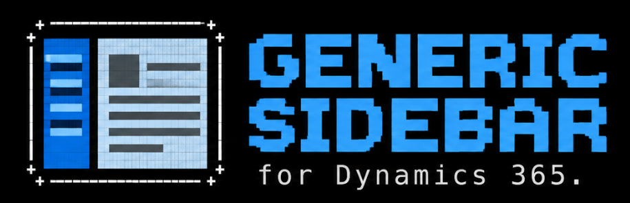
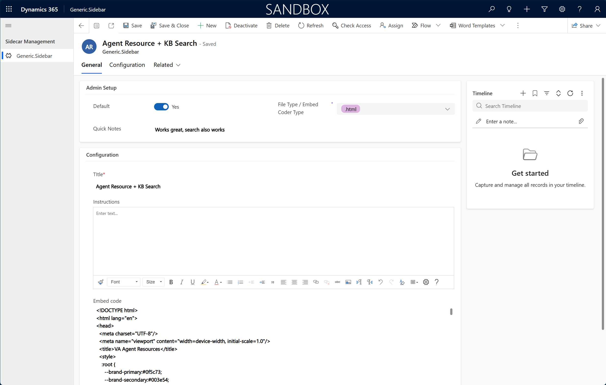
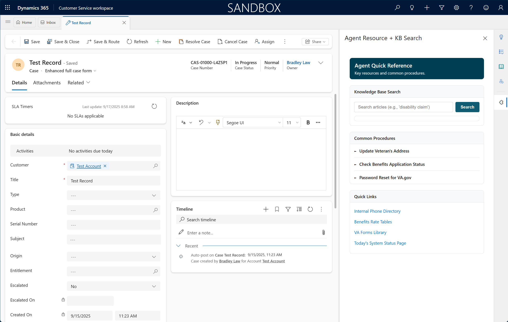
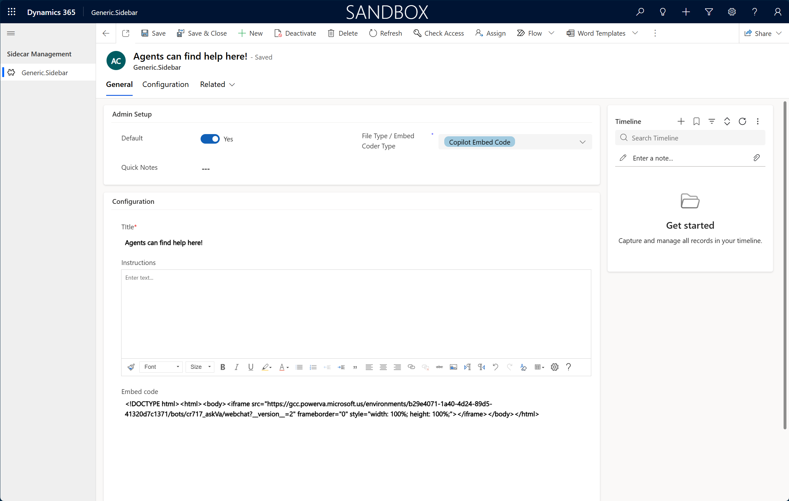
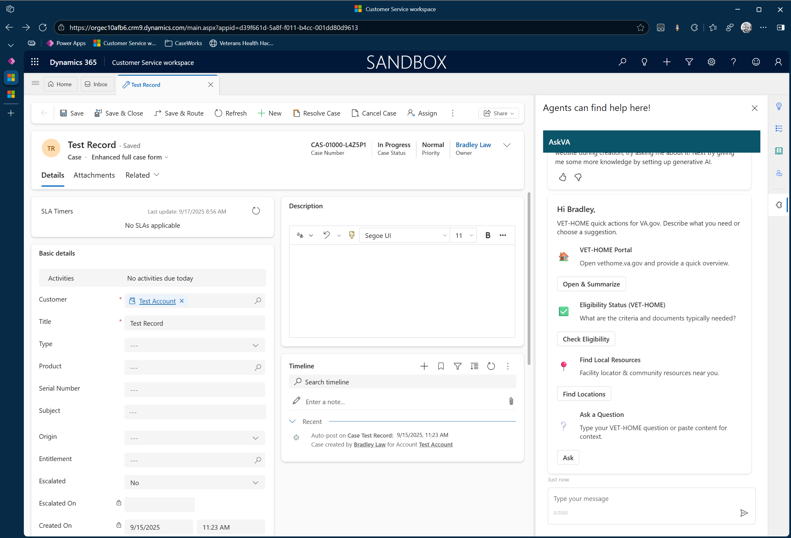

  

# Generic Sidebar for Dynamics 365

Generic Sidebar is a configuration-driven side pane for Dynamics 365 and other model-driven apps. Administrators define panel titles, instructions, embeds, dimensions, and theming in Dataverse instead of hardcoding a different sidebar for every form.

## Current Repository Scope

This repository contains the core Generic Sidebar solution plus optional applications and demo assets that can be embedded in it. These are separate deployment units.

| Component | Current artifact | Relationship to Generic Sidebar |
| --- | --- | --- |
| **Generic Sidebar Core** | `GenericSidebar_1_0_0_5.zip` | The installable Dynamics 365 solution. |
| **Android Cell Phone Simulator** | `Generic.AndroidCellPhone/AndroidCellPhone.html` 2.6.0 | Optional standalone application that can be embedded as sidebar content. It is not included in or required by the core solution. |
| **Genesys Softphone and examples** | Files under `SidecarItems/` | Optional demo integrations and content. They are not core solution prerequisites. |

The versions above identify separate artifacts. Updating an embeddable application does not change the core solution version.

## Generic Sidebar Core

The core solution uses the `sidebar_genericsidebar` Dataverse table to provide a shared sidebar configuration.

### Capabilities

- Up to four configurable panels.
- Rich-text instructions for each panel.
- Embeds from:
  - External URLs
  - HTML or iframe snippets
  - Power Apps canvas apps
  - Copilot Studio experiences
  - Dynamics web resources
- Optional panel icons and theming.
- Configurable iframe size, style, permissions, and referrer policy.
- Pop-out support for URL-based content.
- Shared default configuration selected through `sidebar_default`.

## Install the Core Solution

1. Download or clone this repository.
2. Import `GenericSidebar_1_0_0_5.zip` into the target Dynamics 365 environment as a managed or unmanaged solution.
3. Open the **Generic Sidebar Configuration** table (`sidebar_genericsidebar`).
4. Create or select one configuration record and set `sidebar_default = Yes`.
5. Configure the first panel:
   - `sidebar_title1`
   - `sidebar_instructions`
   - `sidebar_embedcode`
6. Configure panels 2 through 4 with the corresponding numbered fields when needed.
7. Save the configuration and publish customizations.

An embed value can be an external URL, a `webresource:resource_name` reference, an iframe snippet, raw HTML, a Copilot Studio embed, or a Power Apps canvas app embed.

## Add Generic Sidebar to a Form

1. Add the `sidebar_sidebar.js` web resource as a form library.
2. Register `Generic_OpenSidebar` as an OnLoad handler and pass the execution context.
3. Save and publish the form.
4. Publish all customizations, then hard refresh the model-driven app.

The form opens the sidebar; the selected default Dataverse record controls its content.

## Embeddable Applications

### Android Cell Phone Simulator

The Samsung S25 Ultra phone simulator is a separate, self-contained HTML application intended for contact-center demonstrations. It can run standalone, as a Dynamics web resource, or inside a Generic Sidebar panel.

It is not part of the Generic Sidebar core package and is not required to use Generic Sidebar.

- [Android Cell Phone Simulator overview and embed instructions](./Generic.AndroidCellPhone/README.md)
- [Full phone simulator documentation](./Generic.AndroidCellPhone/DOCUMENTATION.md)
- [Phone application source](./Generic.AndroidCellPhone/AndroidCellPhone.html)

### Other Sidecar Content

The [`SidecarItems`](./SidecarItems) directory contains optional examples and integrations, including Copilot, journey, and softphone experiences. Treat each item as independently deployable content unless its own documentation says otherwise.

## Examples

### HTML configuration

### HTML displayed to an end user

### Copilot Studio configuration

### Copilot Studio displayed to an end user

## Validation and Reference Material

- [Acceptance tests](./TEST_ACCEPTANCE.md)
- [UX invariants](./UX_INVARIANTS.md)
- [System manifest](./SYSTEM_MANIFEST.json.md)
- [Binding certification](./BINDING_CERTIFICATION.md)
- [Solution specification](./SPEC.md)

## Known Limitations

- External sites can block iframe embedding through `X-Frame-Options` or Content Security Policy.
- The optional `sidebar_acknowledged` field controls the administrator disclaimer acknowledgement. Environments without that field skip the acknowledgement update.
- Embeddable applications can have their own data, security, browser, and deployment requirements.

## Disclaimer

This project is provided as-is and is intended primarily for demonstrations and proof-of-concept use. Validate security, accessibility, data access, browser policies, and solution behavior in a non-production environment before production deployment.

## License

See [LICENSE](./LICENSE).
